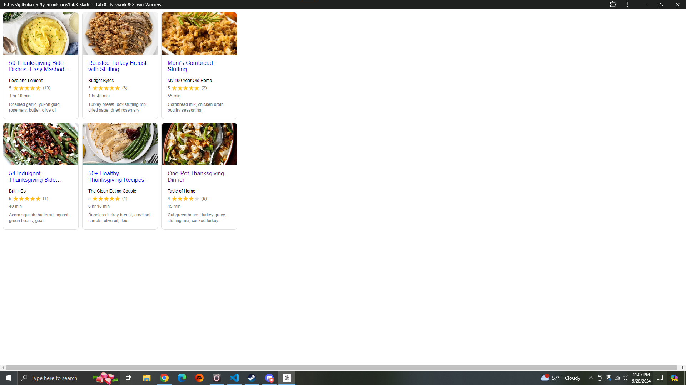

# Lab8-Starter
Tyler Khuc
[Lab 8](https://tylercooksrice.github.io/Lab8-Starter/).

Graceful degration and service workers are related because they both help a webpage in having a fallback. Graceful degration describes the process of having a fallback when certain functionalities of your webpage fails to load therefore the webpage doesn't fail completely and has some of the crucial functions needed by the user. Service workers help programmers complete such task as the page would still be able to load or have some functionalities with the help of service workers. Service workers help the develop create their website when they become offline which helps with graceful degration as webpages can become unavaliable at certain points to and having service workers can help the websites still function despite being offline.
